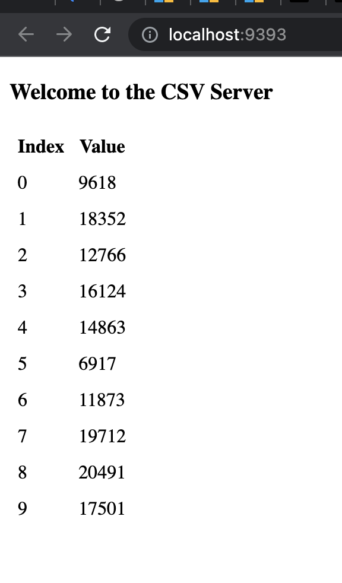
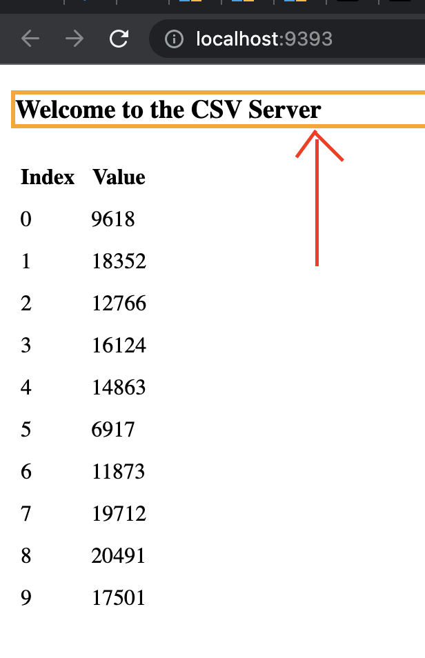
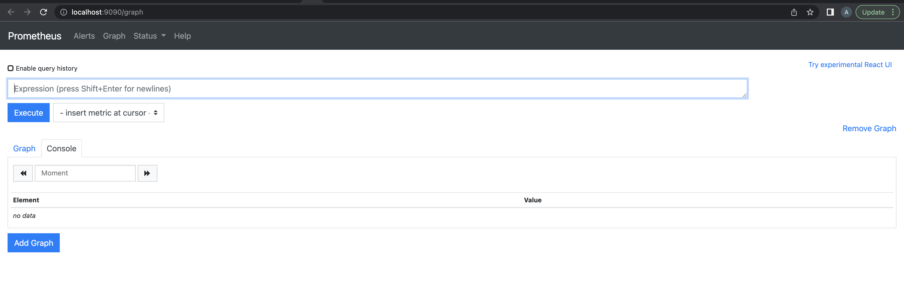
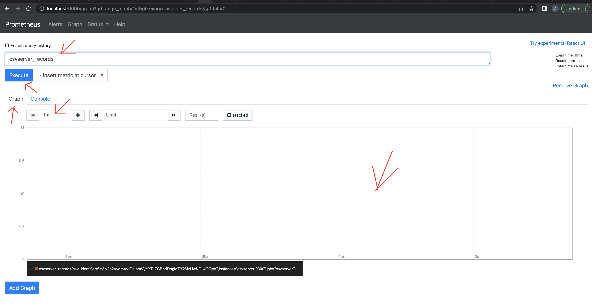

# The csvserver solution


## Part I
  1. Running the container image `infracloudio/csvserver:latest` but it failed to startup with below error.
 
   ```console
   docker run --name csvserver infracloudio/csvserver:latest
   error while reading the file "/csvserver/inputdata": open /csvserver/inputdata: no such file or directory
   ```

     Theres no volume mount or file available /csvserver/inputdata location in container.

     once you attach a volume and run,  it will be executed and the container will be up and running. 
     But before that you have to execute `gencsv.sh` script to generate `inputFile`


  3. Execute `gencsv.sh` to generate a file named `inputFile`:

     ```console
     ./gencv.sh
     ```
     By default it prints 10 values to a inputFile. The script has the capability to generate any number of 
     entries by providing an argument while runing script

     Execute below commands to verify if the file is created and check the content of file

     ls -lrt

     cat inputFile     #These are comma separated values with index and a random number.

  4. Run the container again in the background with file generated from `gencsv.sh` 

   ```console
   docker run -d -v $(pwd)/inputFile:/csvserver/inputdata --name csvserver infracloudio/csvserver:latest
   ```

  5. Run the below command to verify the ports on which container is listening

   ```console
   docker ps
   ```
   
   


  6. As the requirement is to open the endpoint on port 9393, we need to bind the hostport:containerport using below commands.

  First delete the container which we started in earlier step with the container_id

   ```console
   docker ps  # capture the container_id from the output

   docker kill cotainer_id  # kills the running container

   docker run -d -v $(pwd)/inputFile:/csvserver/inputdata -p 9393:9300 --name csvserver infracloudio/csvserver:latest
   
   ```
   - The application is accessible on the host at http://localhost:9393.
   
   


   
  7. We need to setup the Set the environment variable `CSVSERVER_BORDER` to have value `Orange`.
  
     Run the below commands to acheive the desired result. First delete the container which we started in earlier step with the container_id

     ```console
     docker ps  # capture the container_id from the output

     docker kill cotainer_id  # kills the running container

     docker run -d -v $(pwd)/inputFile:/csvserver/inputdata -p 9393:9300 --env CSVSERVER_BORDER=orange infracloudio/csvserver:latest
     ```
     - The application is accessible on the host at http://localhost:9393. It will display Orange Border as expected.
     - 
     


   Do verify the `part-1-cmd` --> Final docker run command, `part-1-output` --> output file, `part-1-logs` --> logs File in the current directory as requested

## Part II
  0. Delete any containers running from the last part.

     ```console
     docker ps  # capture the container_id from the output

     docker kill cotainer_id  # kills the running container
     ```

  1. Run `docker-compose.yaml` file for the setup from part I to run it from file.

     ```console
     docker compose up -d # to run the container ins detached mode
     ```
     
     The application is accessible on the host at http://localhost:9393.


  2. Once verified you can use the below command to kill the containers 
     ```console
     docker compose down  # to stop the running containers
     ```

## Part III
  1. Created new direcrory `prom` for the part 3 solutions
  2. Execute `gencsv.sh` to generate a file named `inputFile`:

     ```console
     ./gencv.sh
     ```
     By default it prints 10 values to a inputFile. The script has the capability to generate any number of 
     entries by providing an argument while runing script

     Execute below commands to verify if the file is created and check the content of file

     ls -lrt

     cat inputFile     #These are comma separated values with index and a random number.
     
  3. Added Prometheus container (`prom/prometheus:v2.22.0`) to the docker-compose.yaml form part II.
  4. Configured Prometheus to collect data from our application at `csvserver:9300/metrics` endpoint. View the `prometheus.yml` for the configuration

     Run below commands to run the containers
     ```console
     docker compose up -d # to run the containers in detached mode
     ```
     
     
  5. Prometheus is accessible at http://localhost:9090 on the host.

     

  6. Type `csvserver_records` in the query box of Prometheus or check in the dorp-down box. Click on Execute and then switch to the Graph tab.
     It should show a straight line graph with value 10 (consider shrinking the time range to 5m).
     
